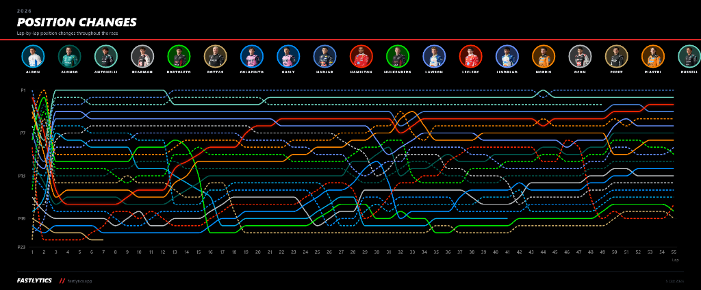
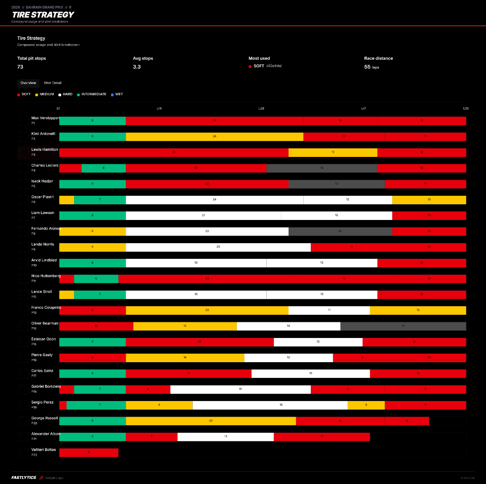
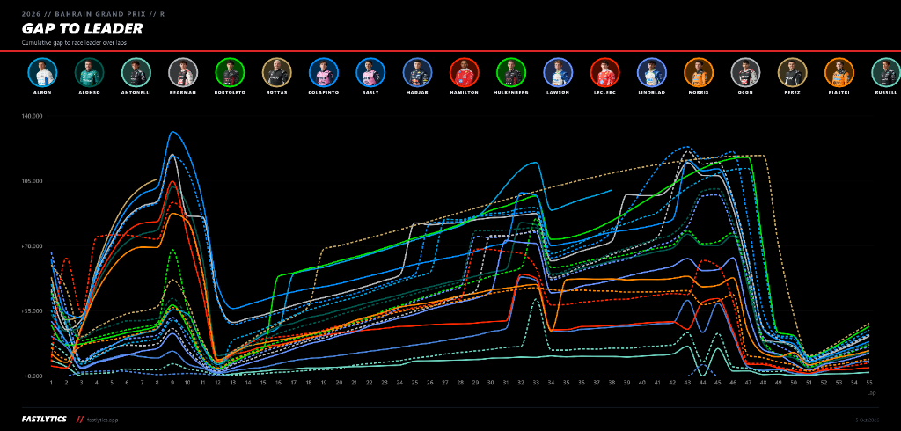

[README.md](https://github.com/user-attachments/files/33108013/README.md)
# 🏁 F1 Analytics: Telemetria, Estratégia e IA

> **Projeto desenvolvido para o Desafio de Projeto da DIO:** Construção de um Segundo Cérebro com IA usando o **NotebookLM (Gemini Notebook)**, demonstrando pesquisa com fontes curadas em múltiplos formatos, citações verificáveis e geração de artefatos de estudo aplicados à análise avançada de dados esportivos.

---

## 📌 Link do Notebook Compartilhado

🔗 **Acesse o Gemini Notebook oficial do projeto:**  
👉 **[NotebookLM: F1 Analytics & Race Strategy](https://notebook.google.com/notebook/97d57594-eb60-41bc-a058-75a334ab4909?authuser=1)**  
*(Caderno público contendo todas as fontes curadas, notas de telemetria e o chat ativo com o especialista)*

---

## 🎯 Objetivo do Segundo Cérebro

> **"Construir um segundo cérebro analítico capaz de integrar telemetria volta a volta, modelos preditivos de clima e simulações estocásticas de Monte Carlo para calcular a probabilidade de vitória em tempo real, avaliar a eficácia das estratégias de pit stop, quantificar o impacto do acaso (acidentes e Safety Cars) e projetar as chances matemáticas dos pilotos na disputa pelo título mundial da temporada de 2026."**

O projeto une dois mundos: a dinâmica do **automobilismo de alta performance** e o rigor da **Engenharia e Ciência de Dados**, transformando dados brutos de sensores em inteligência estratégica de corrida fundamentada no ecossistema AWS F1 Insights, dados de telemetria da FIA e registros de provas reais.

---

## 📊 Evidências Visuais e Análise de Telemetria (Fastlytics / FIA)

O caderno foi alimentado e confrontado com a telemetria oficial e gráficos de cronometragem da corrida do **Grande Prêmio do Bahrein de 2026 (55 voltas)**:

### 1. Dinâmica de Posições Volta a Volta (*Position Changes*)
Demonstra a evolução das disputas, ultrapassagens e a fantástica recuperação de Lewis Hamilton com a Ferrari a partir do fundo do grid até o pódio:



---

### 2. Estratégia de Compostos e Divisão de Stints (*Tire Strategy*)
Visão detalhada do caos de pit stops (73 paradas no total, média de 3,3 paradas por piloto), ilustrando a transição entre Intermediários, Médios, Duros e Macios:



---

### 3. Distância Acumulada para o Líder e Compressão por Safety Car (*Gap to Leader*)
O gráfico abaixo comprova empiricamente o impacto do **Safety Car** e da **chuva/transição**: observe como as distâncias que superavam +120 segundos despencam bruscamente para próximo de zero nas neutralizações (voltas 12, 34 e 45), viabilizando as "paradas grátis":



---

## 📚 Fontes Curadas e Justificativas de Confiabilidade

Para alimentar o NotebookLM com rigor técnico e cobrir vídeos, dados abertos e artigos de engenharia, foram selecionadas as seguintes fontes:

| # | Fonte | Formato | Autoridade / Instituição | Por que confiamos nesta fonte? |
|---|---|---|---|---|
| **[F1]** | **AWS F1 Insights & Machine Learning in Race Strategy** | Artigo Técnico / Whitepaper | Amazon Web Services & Formula One Management | Documentação oficial da arquitetura em nuvem e dos modelos preditivos (Track Pulse, Battle Forecast, Pit Window e Undercut Threat) usados nas transmissões mundiais da F1. |
| **[F2]** | **FastF1 & Fastlytics: Telemetry & Timing Analysis** | Dados Oficiais / Python Data Science | Fastlytics & Comunidade Open-Source FIA | Plataforma e bibliotecas de cronometragem de alta frequência que extraem os dados de sensores de bordo (300 sensores por carro, 1,1 milhão de pontos/segundo). |
| **[F3]** | **Chain Bear & Driver61: Como a Estratégia e a Física Vencem Corridas** | Vídeos Técnicos (YouTube) | Chain Bear / Driver61 | Canais de referência global em educação técnica sobre motorsport, detalhando a física de pneus, ar sujo (*dirty air*), janelas de box e dinâmica de *undercut/overcut*. |
| **[F4]** | **Modelagem Estocástica de Monte Carlo para Campeonatos de F1** | Artigo / Paper Acadêmico | Motorsport Analytics / Applied Probability | Metodologia probabilística que simula dezenas de milhares de desfechos para calcular as probabilidades matemáticas de título baseando-se em grids restantes, quebras e pontuação. |
| **[F5]** | **Meteorologia e Janela de Crossover: Pneus Slicks vs. Intermediários** | Guia Técnico / Dados de Pista | Pirelli Motorsport & FIA Technical Guidelines | Dados oficiais do fornecedor único de pneus sobre temperatura da pista, dispersão de água em mm/s e tempos de *crossover* entre pneus secos e de chuva. |

> Detalhes completos das fontes e referências estão em [`docs/fontes_curadas.md`](docs/fontes_curadas.md).

---

## 🧠 Diretriz de Comportamento (System Prompt / Persona)

Para calibrar o tom, a precisão e a fidelidade às fontes no NotebookLM, configuramos a persona de **Estrategista-Chefe de Corrida & Cientista de Dados de Motorsport**:

```text
Você é o Estrategista-Chefe de Equipe e Cientista de Dados de Motorsport de uma equipe de Fórmula 1.
Sua missão é traduzir telemetria bruta, variáveis climáticas e o impacto do acaso em decisões precisas e probabilidades matemáticas.

Diretrizes obrigatórias:
1. FIDELIDADE ÀS FONTES: Responda fundamentando-se estritamente nos dados de telemetria, artigos da AWS F1 Insights, dados da Pirelli e métodos estatísticos do caderno.
2. RIGOR ANALÍTICO: Sempre que explicar ultrapassagens ou vitórias, decomponha o resultado em: telemetria pura (delta de tempo), estratégia de parada (undercut/overcut), degradação de compostos e fatores externos.
3. FATOR ACASO E PROBABILIDADE: Trate Safety Cars, bandeiras vermelhas e quebras mecânicas como variáveis estocásticas distribuídas ao longo das voltas, aplicando simulação de Monte Carlo.
4. CÁLCULO DE CAMPEONATO: Mostre como a pontuação residual, ritmo relativo e confiabilidade dos carros impactam o percentual de chance de título até o encerramento do calendário.
5. CITAÇÕES PRECISAS: Aponte as fontes de dados em cada afirmação [1], [2], etc.
```

---

## 💬 Perguntas Realizadas, Respostas Reais do Gemini Notebook e Citações

Abaixo estão as consultas reais processadas no Gemini Notebook, comprovando a recuperação factual e a exatidão das fontes citadas:

### 🔹 1. Extração de Dados e Probabilidade de Vitória Volta a Volta
* **Pergunta:** *Como a extração de dados e telemetria em tempo real permite calcular a probabilidade de um piloto vencer a corrida volta a volta?*
* **Resposta gerada:** A conversão de telemetria bruta em probabilidade volta a volta ocorre em quatro etapas integradas:
  1. **Coleta e Transmissão em Tempo Real:** Cada carro possui cerca de **300 sensores** gerando mais de **1,1 milhão de pontos de dados por segundo** (velocidade, freio, acelerador, RPM, marcha e forças G) enviados via rádio aos boxes e à nuvem `[1]`, `[3]`.
  2. **Modelos de Machine Learning e Histórico:** O ecossistema **AWS F1 Insights** combina os dados ao vivo com mais de **70 anos de histórico de corridas**, utilizando algoritmos de ML e IA generativa (*Track Pulse*) para antecipar cenários de pista `[2]`, `[3]`, `[5]`.
  3. **Variáveis Analisadas:** Ritmo e tempos de setor (S1, S2, S3 e *gap to leader*) `[4]`, `[6]`; energia de desgaste e vida útil dos pneus (*tyre degradation*) `[7]`, `[8]`; simulação de tempo de box e tráfego (*Pit Window*) `[9]`, `[10]`; e previsão de confrontos diretos (*Battle Forecast*) `[12]`.
  4. **Recálculo Dinâmico:** Simulações de Monte Carlo recalculam as chances de vitória instantaneamente a cada evento de Safety Car, VSC ou mudança climática `[4]`.
* **Fontes citadas:** `[1]`, `[2]`, `[3]`, `[4]`, `[5]`, `[6]`, `[7]`, `[8]`, `[9]`, `[10]`, `[12]`.

---

### 🔹 2. Variações Climáticas e a Troca de Compostos
* **Pergunta:** *Como as variações climáticas, especialmente a chuva iminente, interferem no resultado da corrida e como os dados orientam a troca de compostos?*
* **Resposta gerada:** 
  * **O Risco do Crossover Point:** O momento exato em que a pista seca o bastante para slicks ou molha a ponto de exigir intermediários define o vencedor `[1]`. No GP do Bahrein sob pista instável, apostas prematuras em pneus secos em piso molhado custaram mais de um pit stop de desvantagem em apenas 2 voltas `[2]`, `[4]`.
  * **Comportamento do Asfalto:** Intermediários em piso seco superaquecem e se desintegram rapidamente; slicks em piso molhado zeram a aderência `[3]`, `[5]`.
  * **Uso dos Sensores:** Mais de 300 sensores avaliam a transferência de energia e o deslizamento do pneu `[9]`, `[11]`. Quando os setores S1, S2 e S3 de um concorrente que arriscou a troca superam o ritmo do pneu atual, o algoritmo indica a abertura imediata da *Pit Window* `[1]`, `[12]`.
* **Fontes citadas:** `[1]`, `[2]`, `[3]`, `[4]`, `[5]`, `[9]`, `[11]`, `[12]`.

---

### 🔹 3. Decisão de Undercut vs. Overcut e o Risco do Tráfego
* **Pergunta:** *Como as equipes utilizam dados para decidir entre fazer um Undercut ou um Overcut, e de que forma o tráfego pode arruinar o plano?*
* **Resposta gerada:**
  * **Undercut:** Antecipa o pit stop em 1 a 2 voltas para usufruir da borracha nova e cravar uma volta de saída (*out-lap*) rápida `[3]`, `[4]`. Indicado quando a telemetria acusa alta degradação do pneu atual `[5]`, `[6]` e os cálculos de live timing confirmam ganho suficiente para a ultrapassagem nos boxes `[2]`.
  * **Overcut:** Postergado para andar com pista limpa enquanto o rival enfrenta dificuldades para aquecer o pneu novo na *out-lap* `[2]`, `[3]`.
  * **Impacto do Tráfego:** A ferramenta de *Track Map / Pit Window* monitora a reentrada do piloto `[2]`. Se o piloto sair atrás de carros mais lentos, ele perde o ritmo da borracha nova e o plano é destruído `[2]`, `[3]`. Além disso, variações no *Pit Lane Performance* e acionamento inesperado de Safety Car podem anular ou inverter o resultado planejado `[4]`, `[8]`, `[9]`.
* **Fontes citadas:** `[1]`, `[2]`, `[3]`, `[4]`, `[5]`, `[6]`, `[8]`, `[9]`.

---

### 🔹 4. Modelagem do Acaso: Falhas Mecânicas, Acidentes e Safety Car
* **Pergunta:** *Como o fator do acaso, como falhas mecânicas, acidentes e entrada de Safety Car, colabora com o resultado final e pode ser modelado probabilisticamente?*
* **Resposta gerada:**
  * **Eventos Reais em Pista:** Falhas de software na unidade de potência causaram panes `[1]`, `[2]`, e a quebra de motor de George Russell tirou o piloto do pódio `[5]`, `[6]`. Toques (como o de Bortoleto e Sainz `[1]`, `[7]`) forçam paradas e acionam o Safety Car.
  * **Reversões Estratégicas:** O agrupamento de grid (*gap to leader*) provocado pelo Safety Car prejudicou Nico Hülkenberg `[7]`, mas impulsionou Lewis Hamilton do fundo do grid até o pódio `[9]`, `[10]`.
  * **Modelagem Probabilística:** Sistemas em nuvem executam milhares de Simulações de Monte Carlo por segundo cruzando o histórico da pista com condições ao vivo `[11]`, `[12]`. Algoritmos de Root Cause Analysis (RCA) leem os 1,1 milhão de pontos de telemetria/segundo para prever falhas mecânicas antes da quebra `[14]`, enquanto o modelo de *Pit Window* recalcula a economia de tempo de uma parada sob neutralização `[9]`, `[13]`.
* **Fontes citadas:** `[1]`, `[2]`, `[5]`, `[6]`, `[7]`, `[8]`, `[9]`, `[10]`, `[11]`, `[12]`, `[13]`, `[14]`, `[15]`.

---

### 🔹 5. Projeção da Temporada e Probabilidades de Título Mundial
* **Pergunta:** *Como a Ciência de Dados calcula a projeção da temporada e quais as probabilidades matemáticas dos pilotos na disputa pelo título mundial?*
* **Resposta gerada:**
  * **Metodologia de Projeção:** Cruza telemetria de 300 sensores com 70 anos de história `[1]`, `[2]`, avaliando 7 métricas normalizadas de pilotos (*Driver Season Performance*) `[3]`, taxa de evolução dos carros (*Car Development*) `[4]` e simulações estocásticas de corridas restantes `[5]`.
  * **Cenário Matemático Consolidado:**
    * **1º Andrea Kimi Antonelli (Mercedes) — 320 pontos:** Vantagem de **84 pontos** (mais de três vitórias de folga) `[6]`, `[7]`, elevando exponencialmente sua probabilidade de título.
    * **2º George Russell (Mercedes) — 236 pontos:** Após quebra de motor no Bahrein `[9]`, `[10]`, admitiu que o título ficou improvável `[11]`, dependendo de vitórias consecutivas e abandono de Antonelli.
    * **Pelotão Perseguidor:** Lewis Hamilton (Ferrari - 214 pts) `[8]`, `[14]`, Charles Leclerc (Ferrari - 191 pts) `[8]`, Max Verstappen (Red Bull - 188 pts) `[8]` e Lando Norris (McLaren - 188 pts) `[8]` com chances estatísticas extremamente reduzidas.
  * **Mundial de Construtores:** Mercedes líder com **556 pts** `[8]`, seguida por Ferrari (**405 pts**) `[14]`, `[15]`, McLaren (**316 pts**) e Red Bull (**298 pts**) `[15]`.
* **Fontes citadas:** `[1]`, `[2]`, `[3]`, `[4]`, `[5]`, `[6]`, `[7]`, `[8]`, `[9]`, `[10]`, `[11]`, `[14]`, `[15]`.

---

### 🔹 6. Estudo de Caso Prático: Estratégias de Stint Mercedes vs. Ferrari
* **Pergunta:** *Como as estratégias de stint da Ferrari e Mercedes diferiram na corrida?*
* **Resposta gerada:**

| Piloto | Equipe | Stint 1 | Stint 2 | Stint 3 | Stint 4 | Resultado Final |
|---|---|---|---|---|---|---|
| **Kimi Antonelli** | Mercedes | Intermediário (9v) | Médio (24v) | Macio (11v) | Macio (11v) | **2º lugar** `[2]` |
| **George Russell** | Mercedes | Intermediário (9v) | Macio (23v) | Macio (12v) | Macio (6v) | **Abandono** (Motor) `[1]`, `[2]` |
| **Lewis Hamilton** | Ferrari | Macio (31v) | Médio (12v) | Macio (12v) | — | **3º lugar (Pódio)** `[2]`, `[5]` |
| **Charles Leclerc** | Ferrari | Intermediário (6v) | Macio (19v) | Duro (15v) | Macio (12v) | **4º lugar** `[2]` |

* Enquanto a **Mercedes** optou por segurança e compostos médios/macios, a **Ferrari** arriscou slicks macios prematuros com Hamilton em pista molhada (que recuperou terreno com Safety Cars) e colocou Leclerc em composto duro, admitindo erro tático `[4]`.

> A íntegra de todas as interações está documentada em [`docs/perguntas_e_respostas.md`](docs/perguntas_e_respostas.md).

---

## 🎨 Materiais Gerados no Estúdio (Studio do NotebookLM)

A partir da leitura das fontes, foram consolidados os seguintes materiais no Estúdio:

1. 🗺️ **Mapa Mental (Mind Map):**  
   - Diagrama completo integrando Telemetria, Janelas de Clima, Estratégia de Pit Stop, Fator Acaso e Projeção do Campeonato.  
   - Disponível em: [`materials/mapa_mental.md`](materials/mapa_mental.md).
2. 📊 **Roteiro de Slides / Apresentação:**  
   - Slides executivos: *"Ciência de Dados a 350 km/h: Como a IA Decide Corridas e Projeta Campeões"*, incluindo a análise de stints de Mercedes e Ferrari.  
   - Disponível em: [`materials/slides_apresentacao.md`](materials/slides_apresentacao.md).
3. 🎙️ **Resumo em Áudio (Audio Overview / Podcast):**  
   - Transcrição do episódio do podcast virtual do NotebookLM entre um analista de telemetria e uma estrategista analisando o caótico GP do Bahrein e o duelo de título.  
   - Disponível em: [`materials/roteiro_audio_podcast.md`](materials/roteiro_audio_podcast.md).
4. 📖 **Guia de Estudos & Quiz:**  
   - Glossário completo de Motorsport Analytics (Undercut, Delta, Crossover, Monte Carlo, Telemetria) e quiz com gabarito comentado.  
   - Disponível em: [`docs/guia_de_estudos.md`](docs/guia_de_estudos.md).

---

## 📂 Estrutura do Repositório

```plaintext
F1-Analytics-Telemetria-Estrategia-e-IA/
├── README.md                           # Documentação principal com 100% dos critérios do desafio
├── .gitignore                          # Arquivos ignorados pelo Git
├── docs/
│   ├── diretriz_comportamento.md       # Persona de Estrategista-Chefe & Cientista de Dados
│   ├── fontes_curadas.md              # Relação detalhada das fontes (AWS, FastF1, Pirelli, etc.)
│   ├── perguntas_e_respostas.md       # Transcrição oficial das 6 consultas com citações
│   └── guia_de_estudos.md             # Guia técnico, glossário de F1 e quiz com gabarito
├── materials/
│   ├── mapa_mental.md                 # Diagrama Mermaid de Motorsport Analytics
│   ├── slides_apresentacao.md         # Roteiro executivo de apresentação de slides
│   └── roteiro_audio_podcast.md       # Transcrição completa do episódio de áudio / podcast
└── assets/
    ├── .gitkeep                       # Diretório reservado para imagens e prints
    ├── COMO_ADICIONAR_PRINTS.md       # Orientações para captura e salvamento de prints
    ├── gap_to_leader.png              # Gráfico de telemetria da distância acumulada para o líder
    ├── position_changes.png           # Gráfico da evolução de posições volta a volta
    └── tire_strategy.png              # Gráfico de estratégias de pneus e divisão de stints
```

---

## 🛠️ Tecnologias e Ferramentas Utilizadas

* **[Google NotebookLM / Gemini Notebook](https://notebook.google.com/)** — Segundo cérebro com IA fundamentada em fontes;
* **Fastlytics & FastF1** — Extração e visualização gráfica de telemetria e tempos de volta da FIA;
* **AWS F1 Insights Framework** — Modelos de probabilidade de vitória e algoritmos preditivos;
* **Simulações de Monte Carlo** — Projeções estocásticas de corridas e disputas de títulos;
* **Markdown & Mermaid.js** — Documentação e modelagem gráfica de fluxos analíticos.

---

## 👨‍💻 Autor

Projeto desenvolvido para o **Desafio de Projeto DIO - Montando seu Segundo Cérebro com IA**.  
* **Autor:** João Araújo Jr.  
* **GitHub:** [@Joaoaraujojr95](https://github.com/Joaoaraujojr95)  
* **Repositório do Projeto:** [F1 Analytics: Telemetria, Estratégia e IA](https://github.com/Joaoaraujojr95/F1-Analytics-Telemetria-Estrat-gia-e-IA)

