# 🗺️ Mapa Mental: F1 Analytics - Telemetria, Estratégia e IA

Este mapa mental sintetiza os 5 pilares de decisão analítica do projeto, integrando sensores de telemetria, meteorologia, estratégia de pista, o fator acaso e o estudo de caso real do GP de Sepang com a disputa de título mundial.

---

## 📊 Diagrama Mermaid

```mermaid
flowchart TD
    ROOT["🏎️ F1 Data Analytics & IA"] --> C1["1. Telemetria & Volta a Volta"]
    ROOT --> C2["2. Clima & Crossover Point"]
    ROOT --> C3["3. Xadrez Estratégico (Mercedes vs Ferrari)"]
    ROOT --> C4["4. O Fator Acaso & Safety Car"]
    ROOT --> C5["5. Projeção de Título Mundial"]

    %% Ramo 1: Telemetria
    C1 --> C1_1["300 Sensores & 1,1M pontos/s\n(Acelerador, Freio, G, RPM)"]
    C1 --> C1_2["AWS F1 Insights & Track Pulse\n(Cruzamento com 70 anos de histórico)"]
    C1 --> C1_3["Desgaste & Energia de Pneu\n(Ângulos de deslizamento e degradação)"]
    C1 --> C1_4["Battle Forecast & Gap to Leader\n(Cálculo preditivo de ataque)"]

    %% Ramo 2: Clima
    C2 --> C2_1["Crossover Point\n(Momento exato da transição Slick / Inter)"]
    C2 --> C2_2["Caso Sepang: Pista Instável\n(Aposta em slicks custou 1 pit stop em 2 voltas)"]
    C2 --> C2_3["Monitoramento de Setores (S1, S2, S3)\n(Abertura imediata da Pit Window)"]
    C2 --> C2_4["Superaquecimento em Seco\n(Destruição de intermediários em pista seca)"]

    %% Ramo 3: Estratégias
    C3 --> C3_1["Undercut vs. Overcut\n(Out-lap com borracha nova vs. ar limpo)"]
    C3 --> C3_2["Gestão de Ar Sujo & Tráfego\n(Evitar retardatários no Track Map)"]
    C3 --> C3_3["Mercedes em Sepang\n(Antonelli P2: Inter->Médio->Macio; Russell DNF)"]
    C3 --> C3_4["Ferrari em Sepang\n(Hamilton P3: Macio 31v; Leclerc P4: Duro 15v)"]

    %% Ramo 4: O Acaso
    C4 --> C4_1["Falhas Mecânicas & Software\n(Pane de PU na largada e quebra de Russell)"]
    C4 --> C4_2["Colisões na Pista\n(Incidente Bortoleto vs. Sainz)"]
    C4 --> C4_3["O Efeito Safety Car\n(Agrupamento do grid e 'parada grátis')"]
    C4 --> C4_4["Previsão RCA & Monte Carlo\n(Milhares de simulações de neutralização por segundo)"]

    %% Ramo 5: Campeonato
    C5 --> C5_1["Líder: Kimi Antonelli (Mercedes)\n(320 pts - 84 pts de vantagem / >3 vitórias)"]
    C5 --> C5_2["Vice: George Russell (Mercedes)\n(236 pts - DNF em Sepang tornou título improvável)"]
    C5 --> C5_3["Perseguidores\n(Hamilton 214 pts, Leclerc 191 pts, Verstappen 188 pts)"]
    C5 --> C5_4["Mundial de Construtores\n(Mercedes 556 pts vs Ferrari 405 pts vs McLaren 316 pts)"]
```

---

## 📑 Estrutura Hierárquica Textual

1. **Fórmula 1 & Análise de Dados Esportivos**
   * **1. Coleta e Telemetria em Tempo Real**
     * Mais de 300 sensores por carro enviando 1,1 milhão de pontos de dados por segundo
     * Nuvem da AWS F1 Insights com 70 anos de corridas históricas
     * Algoritmos de Machine Learning e IA generativa (*Track Pulse*)
     * Monitoramento de energia de desgaste dos pneus e *Battle Forecast*
   * **2. Clima e Ponto de Crossover (Estudo de Caso: Sepang)**
     * Identificação do *Crossover Point* entre pneus secos e intermediários
     * Perda de mais de um pit stop de vantagem por troca precoce para slicks
     * Abertura da *Pit Window* através do monitoramento de setores S1, S2 e S3 dos pioneiros
   * **3. Estratégia de Box e Comparativo de Stints**
     * Dinâmica de *Undercut* (parada antecipada) vs. *Overcut* (permanência na pista)
     * Risco de tráfego e ar sujo (*dirty air*) no mapa de posições
     * Abordagem da Mercedes: Antonelli P2 (consistência de médios/macios) e Russell DNF
     * Abordagem da Ferrari: Hamilton P3 (recuperação com macios) e Leclerc P4 (uso de pneus duros)
   * **4. Modelagem do Acaso e Neutralizações**
     * Falhas de software e panes de unidade de potência (quebra de Russell)
     * Acidentes em pista (toque entre Bortoleto e Sainz)
     * Reversões causadas por Safety Car e o benefício da "parada grátis"
     * Algoritmos de Análise de Causa Raiz (RCA) e Simulações de Monte Carlo
   * **5. Projeções Matemáticas do Campeonato Mundial**
     * Kimi Antonelli isolado na liderança com 320 pontos (+84 pts de vantagem)
     * George Russell vice-líder com 236 pontos (chances reduzidas após abandono)
     * Lewis Hamilton (214 pts), Charles Leclerc (191 pts), Max Verstappen (188 pts) e Lando Norris (188 pts)
     * Mercedes dominando o Mundial de Construtores com 556 pontos contra 405 da Ferrari
